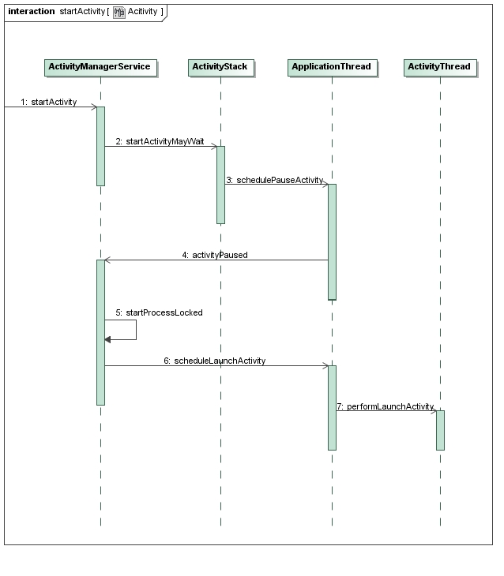
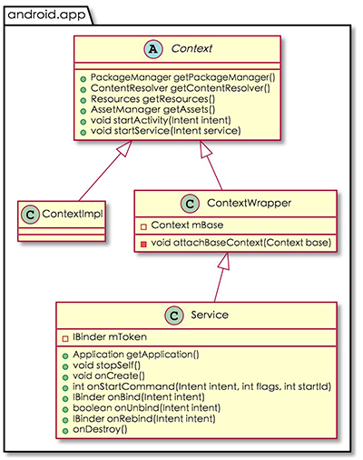

#Android插件技术分享
***
# **Android插件化历史**
----
2012年的时候，大众点评的屠毅敏推出了第一个开源 Android 插件化框架：AndroidDynamicLoader框架，用Fragment来实现。使用一个Activity作为外壳，动态加载一个未安装apk中的Fragment，并通过外壳Activity来处理Fragment的全部生命周期，达到动态加载一个Android视图界面的效果。

2013年，出现了23Code。23Code提供了一个壳（是一个自定义UI控件集合），可以下载一些在这个壳里已经注册的控件，然后动态运行。

2014年4月，任玉刚发布了一个Android插件化项目名为dynamic-load-apk，它没有Hook太多的系统底层方法，而是从上层，即App应用层解决问题，创建一个继承自Activity的ProxyActivity类，然后让插件中的所有Activity都继承自ProxyActivity，并重写Activity所有的方法。

2014年7月,houkx写了一个插件化加载框架，叫android-pluginmgr，开始利用 java 虚拟机字节码操作方式，通过动态生成一个插件类的子类，达到插件化的功能。后来master分支由lody改成了Hook Instrumentation方式加载Activity，dev分支仍保留原来的方案。

2014年11月，当时高一刚入学3个月的 lody 也写了一个插件化框架，叫Direct-Load-apk。DLA使用借壳的方式，将有生命周期的ProxyActivity的所有属性赋值给没有生命周期PluginActivity，然后调用PluginActivity的onCreate让其'活'起来。

2015年8月，张勇发布DroidPlugin。对android的**四大组件**都做了插件化处理，所以可以基于这个框架写一个宿主App，然后就可以把别人写的App都当作插件来加载。

其他开源插件框架：DynamicApk ACDD Small TwsPluginFramework Android-Plugin-Framework
***
#Android插件化原理
----
下面基于DroidPlugin插件框架，介绍一下Android插件化原理。网上介绍DroidPlugin插件框架原理资源[链接](http://weishu.me/2016/01/28/understand-plugin-framework-overview/)
***
##1. Hook Binder
系统Service运行在system_server进程，我们是无法hook掉的，所以我们只能hook系统Service在客户端对应的Binder对象。
**获得系统Service Binder的过程**
```java
public Object getSystemService(String name) {
    return SystemServiceRegistry.getSystemService(this, name);
}
public static Object getSystemService(ContextImpl ctx, String name) {
         ServiceFetcher<?> fetcher = SYSTEM_SERVICE_FETCHERS.get(name);
         return fetcher != null ? fetcher.getService(ctx) : null;
}
 static abstract class CachedServiceFetcher<T> implements ServiceFetcher<T> {
     private final int mCacheIndex;
 
     public CachedServiceFetcher() {
         mCacheIndex = sServiceCacheSize++;
     }
 
     @Override
     @SuppressWarnings("unchecked")
     public final T getService(ContextImpl ctx) {
         final Object[] cache = ctx.mServiceCache;
         synchronized (cache) {
             // Fetch or create the service.
             Object service = cache[mCacheIndex];
             if (service == null) {
                 service = createService(ctx);
                 cache[mCacheIndex] = service;
             }
             return (T)service;
         }
     }
     public abstract T createService(ContextImpl ctx);
 }
registerService(Context.ALARM_SERVICE, AlarmManager.class,
        new CachedServiceFetcher<AlarmManager>() {
    @Override
    public AlarmManager createService(ContextImpl ctx) {
        IBinder b = ServiceManager.getService(Context.ALARM_SERVICE);
        IAlarmManager service = IAlarmManager.Stub.asInterface(b);
        return new AlarmManager(service, ctx);
    }});
```
获得一个系统Service Binder的代码
```java
IBinder b = ServiceManager.getService("xxx"); //BinderProxy
IXXInterface in = IXXInterface.Stub.asInterface(b);
```
**寻找hook点**
由于系统服务的使用者都是对第二步获取到的IXXInterface进行操作，因此如果我们要hook掉某个系统服务，只需要把第二步的asInterface方法返回的对象修改为为我们Hook过的对象就可以了。
***
**asInterface过程**
```java
public static android.content.IClipboard asInterface(android.os.IBinder obj) {
    if ((obj == null)) {
        return null;
    }
    android.os.IInterface iin = obj.queryLocalInterface(DESCRIPTOR); // Hook点
    if (((iin != null) && (iin instanceof android.content.IClipboard))) {
        return ((android.content.IClipboard) iin);
    }
    return new android.content.IClipboard.Stub.Proxy(obj);
}
```
我们可以尝试修改这个obj对象的queryLocalInterface方法的返回值，并保证这个返回值符合接下来的if条件检测，那么就达到了修改asInterface方法返回值的目的。
而这个obj对象刚好是我们第一步返回的IBinder对象，接下来我们尝试对这个IBinder对象的queryLocalInterface方法进行hook。
***
**getService过程**
我们希望能修改这个getService方法的返回值，让这个方法返回一个我们伪造过的IBinder对象；这样，我们可以在自己伪造的IBinder对象的queryLocalInterface方法作处理，进而使得asInterface方法返回在queryLocalInterface方法里面处理过的值，最终实现hook系统服务的目的。
```java
public static IBinder getService(String name) {
    try {
        IBinder service = sCache.get(name);
        if (service != null) {
            return service;
        } else {
            return getIServiceManager().getService(name);
        }
    } catch (RemoteException e) {
        Log.e(TAG, "error in getService", e);
    }
    return null;
}
```
在进程启动时，如果进程不属于孤立进程，系统会缓存一些系统服务Binder对象到这个Map，我们可以替换这个map里面的内容为Hook过的IBinder对象，由于系统在getService的时候每次都会优先查找缓存，因此返回给使用者的都是被我们修改过的对象，从而达到瞒天过海的目的。
**[代码演示Hook系统剪切版服务过程]**
***
##2.插件加载机制及Activity插件化
启动`Activity`非常简单，一个`startActivity`就可以，但是这个`Activity`必须是在AndroidManifest.xml中注册的`Activity`，否则系统校验无法通过。所以想要启动插件的`PluginActivity`，就需要在AndroidManifest.xml中使用一个`ProxyActivity`占坑，在合适的时机使用`PluginActivity`将其替换掉。
有关`Activity`启动过程的系统调用请参考[Android应用程序启动过程源代码分析 - CSDN博客](http://blog.csdn.net/luoshengyang/article/details/6689748)


下面是从`startProcessLocked`开始到`Activity`创建过程的一个简单分析
**[-->ActivityManagerService.java]**
```java
func startProcessLocked
        boolean isActivityProcess = (entryPoint == null);
        if (entryPoint == null) entryPoint = "android.app.ActivityThread";
        checkTime(startTime, "startProcess: asking zygote to start proc");
        Process.ProcessStartResult startResult = Process.start(entryPoint,
            app.processName, uid, uid, gids, debugFlags, mountExternal,
            app.info.targetSdkVersion, app.info.seinfo, requiredAbi,
		    instructionSet, app.info.dataDir, entryPointArgs);
```
**[-->ActivityThread.java]**
```java
func main
    Process.setArgV0("<pre-initialized>")
	Looper.prepareMainLooper();
	ActivityThread thread = new ActivityThread();
	thread.attach(false);
	//....
	Looper.loop();
func attach
    final IActivityManager mgr = ActivityManagerNative().getDefault();
    mgr.attachApplication(mAppThread); //Application mAppThread = new ApplicationThread()；
```
**看一下ApplicationThread是什么？**
**[-->androiod/app/IApplicationThread.java]**
```java
/**
 * System private API for communicating with the application.  This is given to
 * the activity manager by an application  when it starts up, for the activity
 * manager to tell the application about things it needs to do.
 */
public interface IApplicationThread extends IInterface {
    //...
}
```
看注释就很清楚了，它是服务端与客户端通信的桥梁，每一个客户端进程都对应一个`IApplicationThread`，它的实例会在进程创建后传递到服务端，方便服务端与客户端通信。`IApplicationThread`接口的部分实现在 `android.app.ApplicationThreadNative`，它仍然是一个`抽象类`，但是实现了大部分接口中的方法：

**[-->androiod/app/ApplicationThreadNative.java]**
```java
public abstract class ApplicationThreadNative extends Binder
        implements IApplicationThread {
       static public IApplicationThread asInterface(IBinder obj) {
        if (obj == null) {
            return null;
        }
        IApplicationThread in =
            (IApplicationThread) obj.queryLocalInterface(descriptor);
        if (in != null) {
            return in;
        }
        return new ApplicationThreadProxy(obj);
    }
    //...
}
```
真正完整的是`ApplicationThread`。它继承了 `ApplicationThreadNative` ，并实现了所有的抽象方法。它是 `android.app.ActivityThread` 的内部类。
```java
    public final class ActivityThread {
        private class ApplicationThread extends ApplicationThreadNative {
        }
    }
```

**[-->ActivityManagerService.java]**
```java
func attachApplication(IApplicationThread thread)
     attachApplicationLock(thread, callingPid);
     // 回到 ActivityThread.java
	 thread.bindApplication(...)
      // 构建AppBindData sendMessage(H.BIND_APPLICATION, data);
      //  handleBindApplication(AppBindData data)
      // 重置进程名
	  // 创建mInstrumentation, mInitialApplication
	  // 调用mInstrumentation, mInitialApplication onCreate()
    mStackSupervisor.attachApplictionLocked(app) // app is ProcessRecord
    // realStartActivityLocked
	// app.thread.scheduleLaunchActivity
	// ActivityThread.handleLaunchActivity
	//               .performLaunchActivity
```
进行Activity替换合适的时机就在scheduleLaunchActivity与handleLaunchActivity之间
**[-->ActivityThread$ApplicationThread.java]**
```java
func scheduleLaunchActivity
    sendMessage(H.LAUNCH_ACTIVITY, r);
	// r类型是ActivityClientRecord里面的intent 是hook目标
	H.handleMessage(Message msg) // r = msg.obj
	    r.packageInfo = getPackageInfoNoCheck(
		                r.activityInfo.applicationInfo, r.compatInfo);
	    handleLaunchActivity
	    performLaunchActivity
```

方法是无法hook的，所有这里只能拿ActivityThread.mH handler对象做文章。
**[代码演示启动一个未在AndroidManifest.xml声明的Activity]**

**[-->ActivityThread.java]**
```java
func performLaunchActivity
        java.lang.ClassLoader cl = r.packageInfo.getClassLoader();
		activity = mInstrumentation.newActivity(
        		cl, component.getClassName(), r.intent);
		StrictMode.incrementExpectedActivityCount(activity.getClass());
		r.intent.setExtrasClassLoader(cl);
```
通过待启动的Activity的类名className，使用ClassLoader反射创建了这个Activity类的实例对象。
上述例子中TargetActivity与StubActivity存在于同一个Apk，因此apk的ClassLoader能够成功加载并创建TargetActivity的实例。但是在实际的插件系统中，要启动的目标Activity肯定存在于一个单独的文件中，宿主默认的ClassLoader无法加载插件中的Activity类。因此还有一个很重要的问题需要处理：自己创建插件的ClassLoader，启动插件中的Activity。
这个ClasssLoader对象通过r.packageInfo对象的getClassLoader()方法得到，而r.packageInfo是getPackageInfoNoCheck创建的对象：
**[-->ActivityThread.java]**
```java
public final LoadedApk getPackageInfoNoCheck(ApplicationInfo ai,
        CompatibilityInfo compatInfo) {
    return getPackageInfo(ai, compatInfo, null, false, true, false);
}
private LoadedApk getPackageInfo(ApplicationInfo aInfo, CompatibilityInfo compatInfo,
       ClassLoader baseLoader, boolean securityViolation, boolean includeCode,
       boolean registerPackage) {
    final boolean differentUser = (UserHandle.myUserId() != UserHandle.getUserId(aInfo.uid));
    synchronized (mResourcesManager) {
       WeakReference<LoadedApk> ref;
       if (differentUser) {
           // Caching not supported across users
           ref = null;
       } else if (includeCode) {
           ref = mPackages.get(aInfo.packageName);
       } else {
           ref = mResourcePackages.get(aInfo.packageName);
       }

       LoadedApk packageInfo = ref != null ? ref.get() : null;
       if (packageInfo == null || (packageInfo.mResources != null
               && !packageInfo.mResources.getAssets().isUpToDate())) {
           if (localLOGV) Slog.v(TAG, (includeCode ? "Loading code package "
                   : "Loading resource-only package ") + aInfo.packageName
                   + " (in " + (mBoundApplication != null
                           ? mBoundApplication.processName : null)
                   + ")");
           packageInfo =
               new LoadedApk(this, aInfo, compatInfo, baseLoader,
                       securityViolation, includeCode &&
                       (aInfo.flags&ApplicationInfo.FLAG_HAS_CODE) != 0, registerPackage);

           if (mSystemThread && "android".equals(aInfo.packageName)) {
               packageInfo.installSystemApplicationInfo(aInfo,
                       getSystemContext().mPackageInfo.getClassLoader());
           }

           if (differentUser) {
               // Caching not supported across users
           } else if (includeCode) {
               mPackages.put(aInfo.packageName,
                       new WeakReference<LoadedApk>(packageInfo));
           } else {
               mResourcePackages.put(aInfo.packageName,
                       new WeakReference<LoadedApk>(packageInfo));
           }
       }
       return packageInfo;
   }
}
```
所以我们要加载插件的Activity，就需要构建插件的LoadedApk对象及ClassLoader，并将其保存到mPackage中：
1，准备插件的LoadedApk对象及ClassLoader
2，将准备好的LoadedApk放到mPackages中，在getPackageInfo被调用时，直接返回我们创建的LoadedApk对象
3，修改 r.activityInfo.applicationInfo.packageName确保能正确找到插件LoadedApk对象
**[代码演示加载外部apk的activity实例]**
***
##3. Service 插件化

### 理解Service
  Service是Android四大组件之一。在一般的App开发场景中，它的存在往往是为了保证App切换到后台后，仍然具备处理数据的能力。Service实现了一套异步的跨进程通信模型，通过`Binder`机制，Service可以优雅的屏蔽跨进程调用的复杂性。一般来说，一个普通的Service运行在*当前进程的主线程中*，也就是说，如果不开辟线程，把耗时的操作直接甩在Service，那么系统就会赏你一个`ANR`（application Not Responding）警告。当然，为了方便做耗时操作，SDK层也提供了`IntentService`，它开辟了一个Work Thread来顺序处理耗时请求，从而避免了阻塞主进程。
  
### Service的本质
  
  Service家族的体系如图所示：
  
   
   
   `Service`是`Context`的子类，因此具备了`资源访问`和`组件调用`的能力，除此之外，它还具有独立的`生命周期`。
   
   按**运行环境**分类，Service可分为：
   * 前台Service
   * 后台Service
   
  #### 前台Service：
  通过调用 **Service.startForeground(int id, Notification notification)** 可以使一个后台Service成为前台Service，并与一个Notification`绑定`，显示在通知栏。前台Service与后台Service相比，它所在的进程具有更高的`优先级`，在内存不足时更不容易被系统Kill。
  
  #### 后台Service：
  后台Service是指当前没有显示任何界面的Service，处于非前台的Service皆为后台Service，后台Service的优先级低于前台Service，因此在低内存的时候，系统会优先杀掉后台Service。
   
### Service启动流程分析
 Service在`客户端`的启动入口位于 `ContextImpl.startService(Intent intent)`，因此我们从它入手。
 
 **[--> android/app/ContextImpl.java]**
 ```java
     public ComponentName startService(Intent service) {
        //如果当前进程是system-server进程，
        //调用startService会通过Log打印警告信息。
        warnIfCallingFromSystemProcess();
        return startServiceCommon(service, mUser);
    }
 ```
 `startService` 通过调用 `startServiceCommon` 来完成余下的工作，其代码如下：
 ```java
 private ComponentName startServiceCommon(Intent service, UserHandle user) {
        try {
            //验证启动目标Service的Intent的合法性
            validateServiceIntent(service);
            //让Intent为跨进程调用做准备
            service.prepareToLeaveProcess();
            //调用ActivityManagerNative的startService，
            //这实际上是一个远程调用。
            ComponentName cn = ActivityManagerNative.getDefault().startService(
                mMainThread.getApplicationThread(), service,
                service.resolveTypeIfNeeded(getContentResolver()), user.getIdentifier());
            //根据调用结果做对应的处理
            if (cn != null) {
                if (cn.getPackageName().equals("!")) {
                    //不具备调用目标Service的权限
                    throw new SecurityException(
                            "Not allowed to start service " + service
                            + " without permission " + cn.getClassName());
                } else if (cn.getPackageName().equals("!!")) {
                    // 无法启动目标Service的处理
                    throw new SecurityException(
                            "Unable to start service " + service
                            + ": " + cn.getClassName());
                }
            }
            return cn;
        } catch (RemoteException e) {
            return null;
        }
    }
 ```
 `startServiceCommon` 首先验证启动目标Service的Intent的合法性，然后调用 `ActivityManagerNative.startService(...)` 来启动Service，最后做了收尾工作。

**`startService`在服务端的实现:**
 **[-->com/android/server/am/ActivityManagerService.java]**
 ```java
     public ComponentName startService(IApplicationThread caller, Intent service,
            String resolvedType, int userId) {
        enforceNotIsolatedCaller("startService");
        // 拒绝包含可能造成内存泄露的文件描述符的Intent
        if (service != null && service.hasFileDescriptors() == true) {
            throw new IllegalArgumentException("File descriptors passed in Intent");
        }
        synchronized(this) {
            final int callingPid = Binder.getCallingPid();
            final int callingUid = Binder.getCallingUid();
            final long origId = Binder.clearCallingIdentity();
            ComponentName res = mServices.startServiceLocked(caller, service,
                    resolvedType, callingPid, callingUid, userId);
            Binder.restoreCallingIdentity(origId);
            return res;
        }
    }
```
 `ActivityManagerService`的`startService`被客户端调用后，首先对 Intent 进行检查，然后跳转到调用`mServices.startServiceLocked(...)`进行余下工作。这里的mService的类型是`ActiveServices`
 **[-->com/android/server/am/ActiveServices.java]**
 ```java
     ComponentName startServiceLocked(IApplicationThread caller,
            Intent service, String resolvedType,
            int callingPid, int callingUid, int userId) {

        final boolean callerFg;
        //检查调用方身份
        if (caller != null) {
            final ProcessRecord callerApp = mAm.getRecordForAppLocked(caller);
            //在ActivityManagerService中查询不到调用者，直接抛出异常。
            if (callerApp == null) {
                throw new SecurityException(
                        "Unable to find app for caller " + caller
                        + " (pid=" + Binder.getCallingPid()
                        + ") when starting service " + service);
            }
            //判断调用方是前台进程还是后台进程
            callerFg = callerApp.setSchedGroup != Process.THREAD_GROUP_BG_NONINTERACTIVE;
        } else {
            callerFg = true;
        }
        //检索匹配Service组件信息
        ServiceLookupResult res =
            retrieveServiceLocked(service, resolvedType,
                    callingPid, callingUid, userId, true, callerFg);
        //没有匹配到Service组件
        if (res == null) {
            return null;
        }
        if (res.record == null) {
            //目标Service组的android:export属性为false
            return new ComponentName("!", res.permission != null
                    ? res.permission : "private to package");
        }
        
        ServiceRecord r = res.record;
        
        if (!mAm.getUserManagerLocked().exists(r.userId)) {
            //目标Service组件不存在于任何User
            Slog.d(TAG, "Trying to start service with non-existent user! " + r.userId);
            return null;
        }
        //Uri权限检查
        NeededUriGrants neededGrants = mAm.checkGrantUriPermissionFromIntentLocked(
                callingUid, r.packageName, service, service.getFlags(), null, r.userId);
        
        //如果目标的Service正在被请求重启，但还未重启，取消这个请求
        if (unscheduleServiceRestartLocked(r, callingUid, false)) {
            if (DEBUG_SERVICE) Slog.v(TAG, "START SERVICE WHILE RESTART PENDING: " + r);
        }
        r.lastActivity = SystemClock.uptimeMillis();
        r.startRequested = true;
        r.delayedStop = false;
        r.pendingStarts.add(new ServiceRecord.StartItem(r, false, r.makeNextStartId(),
                service, neededGrants));
        final ServiceMap smap = getServiceMap(r.userId);
        boolean addToStarting = false;
        if (!callerFg && r.app == null && mAm.mStartedUsers.get(r.userId) != null) {
            ProcessRecord proc = mAm.getProcessRecordLocked(r.processName, r.appInfo.uid, false);
            
            if (proc == null || proc.curProcState > ActivityManager.PROCESS_STATE_RECEIVER) {
            
                if (r.delayed) {
                    // 目标Service正在启动中，但还没有启动完成。
                    return r.name;
                }
                if (smap.mStartingBackground.size() >= mMaxStartingBackground) {
                    // 该进程有其它组件正在启动，等待它完成后再启动。
                    Slog.i(TAG, "Delaying start of: " + r);
                    smap.mDelayedStartList.add(r);
                    r.delayed = true;
                    return r.name;
                }
                addToStarting = true;
            } else if (proc.curProcState >= ActivityManager.PROCESS_STATE_SERVICE) {
                addToStarting = true;
            } 
        } 
        return startServiceInnerLocked(smap, service, r, callerFg, addToStarting);
    }
 ```
 这里解释一下`startServiceLocked`的工作流程。
 * 检查了调用者的身份，以防止`匿名组件攻击`。
 * 根据客户端传入的数据`检索`匹配的Service组件信息。
 * 如果检索成功，进一步检查客户端是否有权限调起目标Service。对于在`AndroidManifest.xml`将 `android:export标签`设为 **false**的 `Service`，只有调用者与目标Service包名相同并且uid相同时才允许调起。
 * 如果目标的Service正在被请求重启，但还未重启，取消这个请求。
 * 如果目标进程已经创建， 但进程有其它组件正在启动，等待它完成后再启动。

在完成以上流程后，它调用了`startServiceInnerLocked`来完成余下的工作：

```java
    ComponentName startServiceInnerLocked(ServiceMap smap, Intent service,
            ServiceRecord r, boolean callerFg, boolean addToStarting) {
        ProcessStats.ServiceState stracker = r.getTracker();
        if (stracker != null) {
            //跟踪Service的内存消耗
            stracker.setStarted(true, mAm.mProcessStats.getMemFactorLocked(), r.lastActivity);
        }
        r.callStart = false;
        synchronized (r.stats.getBatteryStats()) {
            //跟踪Service的耗电量
            r.stats.startRunningLocked();
        }
        //通知客户端进程启动Service
        String error = bringUpServiceLocked(r, service.getFlags(), callerFg, false);
        if (error != null) {
            //启动失败
            return new ComponentName("!!", error);
        }

        if (r.startRequested && addToStarting) {
            boolean first = smap.mStartingBackground.size() == 0;
            smap.mStartingBackground.add(r);
            //设定客户端Service启动超时的时间
            r.startingBgTimeout = SystemClock.uptimeMillis() + BG_START_TIMEOUT;
            if (first) {
                smap.rescheduleDelayedStarts();
            }
        } else if (callerFg) {
            smap.ensureNotStartingBackground(r);
        }

        return r.name;
    }
```
这个函数中，启动了对Service内存消耗和电量消耗的跟踪，然而到了最关键的一步：**调起目标客户端进程来启动Service**。它的逻辑实现在 `bringUpServiceLocked(...)`中，我们来到这个函数：

```java
private final String bringUpServiceLocked(ServiceRecord r,
            int intentFlags, boolean execInFg, boolean whileRestarting) {

        if (r.app != null && r.app.thread != null) {
            //目标Service已经启动
            sendServiceArgsLocked(r, execInFg, false);
            return null;
        }

        if (!whileRestarting && r.restartDelay > 0) {
            // 如果目标Service正在等待restart完成，什么都不用做，直接返回。
            return null;
        }
        //从正在重启的Service列表中移除目标Service
        if (mRestartingServices.remove(r)) {
            clearRestartingIfNeededLocked(r);
        }
        //目标Service不再是delayed状态
        if (r.delayed) {
           getServiceMap(r.userId).mDelayedStartList.remove(r);
            r.delayed = false;
        }
        // 确保目标Service所属的User处于started状态。
        if (mAm.mStartedUsers.get(r.userId) == null) {
            String msg = "Unable to launch app "
                    + r.appInfo.packageName + "/"
                    + r.appInfo.uid + " for service "
                    + r.intent.getIntent() + ": user " + r.userId + " is stopped";
            Slog.w(TAG, msg);
            bringDownServiceLocked(r);
            return msg;
        }

        //Service即将被启动，它所属的Package不能被停止。
        try {
            AppGlobals.getPackageManager().setPackageStoppedState(
                    r.packageName, false, r.userId);
        } catch (RemoteException e) {
        } catch (IllegalArgumentException e) {
            Slog.w(TAG, "Failed trying to unstop package "
                    + r.packageName + ": " + e);
        }
        
        //检查要启动的Service是否被隔离
        final boolean isolated = (r.serviceInfo.flags&ServiceInfo.FLAG_ISOLATED_PROCESS) != 0;
        final String procName = r.processName;
        ProcessRecord app;

        if (!isolated) {
            app = mAm.getProcessRecordLocked(procName, r.appInfo.uid, false);
            //目标进程已经创建
            if (app != null && app.thread != null) {
                try {
                    //该进程又多了一个正在运行的Package
                    app.addPackage(r.appInfo.packageName, r.appInfo.versionCode, mAm.mProcessStats);
                    //在客户端创建并启动目标Service
                    realStartServiceLocked(r, app, execInFg);
                    return null;
                } catch (RemoteException e) {
                    Slog.w(TAG, "Exception when starting service " + r.shortName, e);
                }
            }
        } else {
            app = r.isolatedProc;
        }

        //目标进程还未创建
        if (app == null) {
            //通过ActivityManagerService来创建目标进程，调用将阻塞到目标进程创建完成为止
            if ((app=mAm.startProcessLocked(procName, r.appInfo, true, intentFlags,
                    "service", r.name, false, isolated, false)) == null) {
                //运行到这里说明目标进程创建失败
                String msg = "Unable to launch app "
                        + r.appInfo.packageName + "/"
                        + r.appInfo.uid + " for service "
                        + r.intent.getIntent() + ": process is bad";
                Slog.w(TAG, msg);
                bringDownServiceLocked(r);
                return msg;
            }
            if (isolated) {
                r.isolatedProc = app;
            }
        }
        //将目标Service添加到 正在启动Service但未启动完成 的Service列表中
        if (!mPendingServices.contains(r)) {
            mPendingServices.add(r);
        }

        if (r.delayedStop) {
            r.delayedStop = false;
            if (r.startRequested) {
                stopServiceLocked(r);
            }
        }
        return null;
    }
```
这个函数又依次做了以下事情：
* 如果目标Service已经启动，直接`sendServiceArgsLocked(...)`并返回。
* 如果目标Service正在被重启，但未重启完成，直接返回。
* 从`正在重启的Service列表`中移除目标Service。
* 清除目标Service的`delayed状态`。
* 如果目标Service所属的User未处于`started状态`，则不允许启动目标Service。
* 判断目标Service所处的进程是否`已经创建`。
* 如果进程已经创建，通过 `realStartServiceLocked(...)` 通知客户端创建并启动目标Service。
* 如果进程还未创建，通过 `ActivityManagerService`的 `startProcessLocked(...)`来创建目标进程。
* 将目标Service添加到 正在启动Service但未启动完成 的Service列表中。

故真正创建和启动Service的逻辑在 `realStartServiceLocked`，我们来到这个函数：

```java
    private final void realStartServiceLocked(ServiceRecord r,
            ProcessRecord app, boolean execInFg) throws RemoteException {
        if (app.thread == null) {
            throw new RemoteException();
        }
        //填充ServiceRecord
        r.app = app;
        r.restartTime = r.lastActivity = SystemClock.uptimeMillis();

        app.services.add(r);
        bumpServiceExecutingLocked(r, execInFg, "create");
        mAm.updateLruProcessLocked(app, false, null);
        mAm.updateOomAdjLocked();

        boolean created = false;
        try {
            synchronized (r.stats.getBatteryStats()) {
                r.stats.startLaunchedLocked();
            }
            //确保目标App的Dex已经优化完成
            mAm.ensurePackageDexOpt(r.serviceInfo.packageName);
            app.forceProcessStateUpTo(ActivityManager.PROCESS_STATE_SERVICE);
            //通知客户端的ApplicationThread创建和启动目标Service
            app.thread.scheduleCreateService(r, r.serviceInfo,
                    mAm.compatibilityInfoForPackageLocked(r.serviceInfo.applicationInfo),
                    app.repProcState);
            r.postNotification();
            created = true;
        } catch (DeadObjectException e) {
            //在启动Service的过程中，目标进程突然挂了
            Slog.w(TAG, "Application dead when creating service " + r);
            mAm.appDiedLocked(app);
        } finally {
            if (!created) {
                app.services.remove(r);
                r.app = null;
                scheduleServiceRestartLocked(r, false);
                return;
            }
        }
        //如果Service需要绑定，则绑定目标Service
        requestServiceBindingsLocked(r, execInFg);

        updateServiceClientActivitiesLocked(app, null, true);

        if (r.startRequested && r.callStart && r.pendingStarts.size() == 0) {
            r.pendingStarts.add(new ServiceRecord.StartItem(r, false, r.makeNextStartId(),
                    null, null));
        }
        //通知客户端ApplicationThread调用目标Service的onStartCommand方法
        sendServiceArgsLocked(r, execInFg, true);

        if (r.delayed) {
            getServiceMap(r.userId).mDelayedStartList.remove(r);
            r.delayed = false;
        }

        if (r.delayedStop) {
            r.delayedStop = false;
            if (r.startRequested) {
                stopServiceLocked(r);
            }
        }
    }
```
代码比较简单，服务端首先填充ServiceRecord中关于目标Service的数据，一切无误后远程调用客户端的 `scheduleCreateService` 函数来创建目标Service。`scheduleCreateService` 函数位于 `android.app.IApplicationThread`接口。

**[-->androiod/app/ActivityThread.java]**

```java
    public final class ActivityThread {
        private class ApplicationThread extends ApplicationThreadNative {
            public final void scheduleCreateService(IBinder token,
                ServiceInfo info, CompatibilityInfo compatInfo, int processState) {
				updateProcessState(processState, false);
				CreateServiceData s = new CreateServiceData();
				s.token = token;
				s.info = info;
				s.compatInfo = compatInfo;
				发送请求到Handler
				sendMessage(H.CREATE_SERVICE, s);
            }
        }
    }
```
`scheduleCreateService`中将传递进来的参数包装成了一个`CreateServiceData`，然后通过`sendMessage`传递到Handler。因此，消息发送到的是`ActivityThread`中的`mH`。`mH`的类型为**H**，继承自Handler：
```java
private class H extends Handler {
          public static final int CREATE_SERVICE          = 114;
          //...
          public void handleMessage(Message msg) {
              switch(msg.what) {
                case CREATE_SERVICE:
                    Trace.traceBegin(Trace.TRACE_TAG_ACTIVITY_MANAGER, "serviceCreate");
                    handleCreateService((CreateServiceData)msg.obj);
                    Trace.traceEnd(Trace.TRACE_TAG_ACTIVITY_MANAGER);
                    break;
                //...
              }
          }

}
```
`mH`收到`what`为`CREATE_SERVICE`的Message后，通过 `handleCreateService`做后续处理：
  ```java
      private void handleCreateService(CreateServiceData data) {
        //停止空闲时自动触发GC的机制
        unscheduleGcIdler();
        //取得App对应的LoadedApk
        LoadedApk packageInfo = getPackageInfoNoCheck(
                data.info.applicationInfo, data.compatInfo);
        //创建Service
        Service service = null;
        try {
            //通过反射来创建Service实例
            java.lang.ClassLoader cl = packageInfo.getClassLoader();
            service = (Service) cl.loadClass(data.info.name).newInstance();
        } catch (Exception e) {
            //...
        }

        try {
            //创建Service的base context
            ContextImpl context = ContextImpl.createAppContext(this, packageInfo);
            context.setOuterContext(service);
            //取得Application
            Application app = packageInfo.makeApplication(false, mInstrumentation);
            //填充信息到Service
            service.attach(context, this, data.info.name, data.token, app,
                    ActivityManagerNative.getDefault());
            service.onCreate();
            //将创建完成的Service放入mServices这个Map中
            mServices.put(data.token, service);
            try {
               //通知服务端，Service启动完成。
               ActivityManagerNative.getDefault().serviceDoneExecuting(
                        data.token, SERVICE_DONE_EXECUTING_ANON, 0, 0);
            } catch (RemoteException e) {
                // nothing to do.
            }
        } catch (Exception e) {
            //...
        }
    }
```
代码十分清晰，这个函数做了以下事情：
  * 根据`ServiceInfo`中的`ApplicationInfo`取得App对应的LoadedApk。
  * 通过`LoadedApk`拿到`ClassLoader`来反射创建目标Service实例。
  * 通过`ContextImpl.createAppContext(...)`来创建base context。前面分析过，Service继承自**ContextWrapper**，它的`attachBaseContext`方法传入的就是这里的`context`。
  * 填充信息到Service，这样Service才能知道自己的身份。
  * 调用`Service.onCreate`方法。
  * 将创建完成的Service放入`mServices`这个 Map 中。
  * 通知服务端，Service启动完成。如果前面的过程耗时太长，服务端会认为客户端的Service启动失败。

##DroidPlugin Service插件化的实现:代理分发技术
代理分发技术实现，首先hook掉ActivityManagerNative的startService与stopService方法，这样在PluginService启动时将其重定向为启动ProxyService，因为最终要启动的是PluginService，所以在ProxyService启动后，在其生命周期方法中启动PluginService。通过反射调用 ActivityThread.handleCreateService方法可以创建出PluginService对象，在handleCreateService方法中会通知服务端，service创建完成
```java
	   ActivityManagerNative.getDefault().serviceDoneExecuting(
				data.token, SERVICE_DONE_EXECUTING_ANON, 0, 0);
```
需要hook掉这个函数，PluginService的创建不需要通知AMS

**[代码演示Service插件化]**

##如何使插件运行在单独的进程中
上面演示的例子都是hook宿主的运行环境，把插件加载到宿主进程运行，如何使插件像DroidPlugin或VirtualApp一样作为一个独立的进程运行？宿主程序作为一个运行在Android系统中的普通App，是没有权限创建新进程的。看看DroidPlugin是如何实现的:
```xml
        <activity
            android:name=".stub.ActivityStub$Dialog$P08$SingleTop03"
            android:allowTaskReparenting="true"
            android:excludeFromRecents="true"
            android:exported="false"
            android:hardwareAccelerated="true"
            android:label="@string/stub_name_activity"
            android:launchMode="singleTop"
            android:process=":PluginP08"
            android:theme="@style/DroidPluginThemeDialog">
            <intent-filter>
                <action android:name="android.intent.action.MAIN" />
                <category android:name="com.morgoo.droidplugin.category.PROXY_STUB" />
            </intent-filter>
            <meta-data
                android:name="com.morgoo.droidplugin.ACTIVITY_STUB_INDEX"
                android:value="3" />
        </activity>

        <service
            android:name=".stub.ServiceStub$StubP08$P00"
            android:exported="false"
            android:label="@string/stub_name_service"
            android:process=":PluginP08">
            <intent-filter>
                <action android:name="android.intent.action.MAIN" />
                <category android:name="com.morgoo.droidplugin.category.PROXY_STUB" />
            </intent-filter>
        </service>
        <provider
            android:name=".stub.ContentProviderStub$StubP08"
            android:authorities="com.morgoo.droidplugin_stub_P08"
            android:exported="false"
            android:label="@string/stub_name_povider"
            android:process=":PluginP08" />
```
在AndroidManifest.xml中声明代理组件占坑时，顺便指定了`android:process`，当这个组件启动时，系统会为其新创建一个进程，以插件Activity启动为例，我们重新看一下Activity的启动过程。
**[代码演示独立进程运行插件]**

##BroadcastReceiver插件化：静态广播动态注册
广播我们可以通过解析插件的AndroidManifest.xml得到，因为广播是属于插件的，我们要将其注册到插件中。下面介绍静态广播动态注册在DroidPlugin中的实现：
插件在DroidPlugin中是以独立进程启动的，hook ActivityThread的mInstrumentation，进而在插件的生命周期被调用时，可以做一些事情
**[InstrumentationHook.java]**
```java
public class InstrumentationHook extends Hook {
    @Override
    protected void onInstall(ClassLoader classLoader) throws Throwable {

        Object target = ActivityThreadCompat.currentActivityThread();
        Class ActivityThreadClass = ActivityThreadCompat.activityThreadClass();

         /*替换ActivityThread.mInstrumentation，拦截组件调度消息*/
        Field mInstrumentationField = FieldUtils.getField(ActivityThreadClass, "mInstrumentation");
        Instrumentation mInstrumentation = (Instrumentation) FieldUtils.readField(mInstrumentationField, target);
        if (!PluginInstrumentation.class.isInstance(mInstrumentation)) {
            PluginInstrumentation pit = new PluginInstrumentation(mHostContext, mInstrumentation);
            pit.setEnable(isEnable());
            mPluginInstrumentations.add(pit);
            FieldUtils.writeField(mInstrumentationField, target, pit);
            Log.i(TAG, "Install Instrumentation Hook old=%s,new=%s", mInstrumentationField, pit);
        } else {
            Log.i(TAG, "Instrumentation has installed,skip");
        }
    }
}
```
**[PluginInstrumentation.java]**
```java
public class PluginInstrumentation extends Instrumentation {
	@Override
    public void callApplicationOnCreate(Application app) {
		PluginProcessManager.registerStaticReceiver(app,
				app.getApplicationInfo(), app.getClassLoader());
	}
}

    public static void registerStaticReceiver(Context context, ApplicationInfo pluginApplicationInfo, ClassLoader cl) throws Exception {
        List<ActivityInfo> infos = PluginManager.getInstance().getReceivers(pluginApplicationInfo.packageName, 0);
        if (infos != null && infos.size() > 0) {
            CharSequence myPname = null;
            try {
                myPname = PluginManager.getInstance().getProcessNameByPid(android.os.Process.myPid());
            } catch (Exception e) {
            }
            for (ActivityInfo info : infos) {
                if (TextUtils.equals(info.processName, myPname)) {
                    try {
                        List<IntentFilter> filters = PluginManager.getInstance().getReceiverIntentFilter(info);
                        for (IntentFilter filter : filters) {
                            BroadcastReceiver receiver = (BroadcastReceiver) cl.loadClass(info.name).newInstance();
                            context.registerReceiver(receiver, filter);
                        }
                    } catch (Exception e) {
                        Log.e(TAG, "registerStaticReceiver error=%s", e, info.name);
                    }
                }
            }
        }
    }
```


